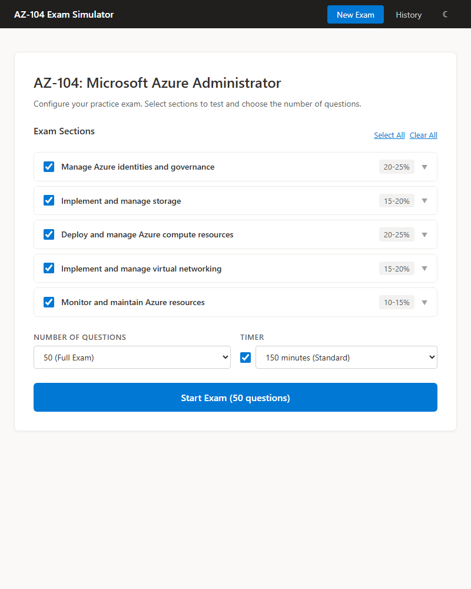
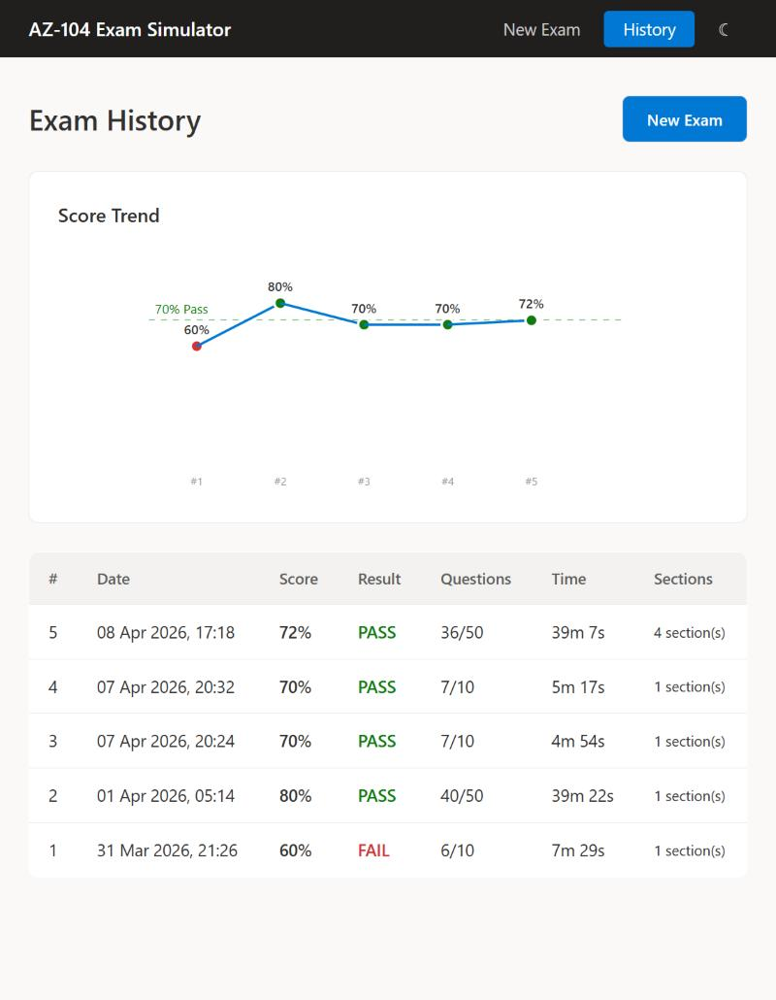

# AZ-104 Exam Simulator

A comprehensive practice exam tool for the Microsoft Azure Administrator (AZ-104) certification. Features ~800 realistic exam questions across all 5 exam domains with multiple question types, timed exams, and detailed attempt history.





## Features

- **~800 Exam Questions** - 10+ questions per bullet point covering all AZ-104 exam objectives
- **6 Question Types** - Single choice, multiple choice, drag & drop, dropdown, yes/no statements, and case studies
- **Timed Exams** - Configurable timer (30-180 minutes, default 150) with visual warnings
- **Section Selection** - Choose which exam domains to test (identity, storage, compute, networking, monitoring)
- **Flexible Question Count** - 10 to 100 questions per session
- **Exam Review** - Detailed feedback with correct answers and explanations after completion
- **Attempt History** - SQLite database tracks all past attempts with score trends
- **Dark Mode** - Toggle between light and dark themes; respects system preference and persists your choice
- **Realistic Interface** - Microsoft-themed UI mimicking the actual AZ-104 exam experience

## Quick Start

### Prerequisites
- Node.js 18+ and npm
- ~500MB disk space for dependencies and question data

### Installation & Run

```bash
npm install          # Install dependencies (first time only)
npm run dev          # Start development servers
```

Run these commands from the project's root directory (wherever you cloned/copied this folder).

Open your browser to: **http://localhost:3000**

The app will automatically:
- Compile the React frontend (Vite on port 3000)
- Start the Express API server (port 3001)
- Create SQLite database (`data/exam.db`) on first run
- Enable hot-reload on code changes

### Stop the App

Press `Ctrl+C` in the terminal.

---

## Usage

### 1. Start a New Exam
- **Select Sections**: Check/uncheck exam domains (all enabled by default)
  - Manage Azure identities and governance (20-25%)
  - Implement and manage storage (15-20%)
  - Deploy and manage Azure compute resources (20-25%)
  - Implement and manage virtual networking (15-20%)
  - Monitor and maintain Azure resources (10-15%)
- **Choose Question Count**: 10, 25, 40, 50, 75, or 100 questions
- **Configure Timer**: Enable/disable timer, set duration (30-180 minutes)
- **Click "Start Exam"**

### 2. Take the Exam
- **Left Sidebar**: Question navigator showing status (unanswered, answered, flagged)
- **Timer**: Top of sidebar counts down; color changes to orange (<5 min) and red (<1 min)
- **Question Area**: Displays current question with appropriate input method:
  - Radio buttons (single choice)
  - Checkboxes (multiple choice)
  - Drag-and-drop interface
  - Dropdown selects
  - Yes/No radio table
  - Tabbed case study scenarios
- **Flag for Review**: Mark questions to revisit
- **Navigation**: Previous/Next buttons to move between questions
- **End Exam**: Submit answers and proceed to review (confirmation required)

### 3. Review Results
- **Score Display**: Scaled to 1000 (passing score = 700+)
- **Section Breakdown**: Per-section percentage with visual progress bars
- **Question Review**: Click any question number to review with:
  - Your answer vs. correct answer
  - Detailed explanation
  - Color-coded correct/incorrect indicators
- **Options**: Take new exam or view history

### 4. View History
- **Attempts Table**: All past exams with date, score, result, questions answered, time taken
- **Score Trend Chart**: Visualize improvement over time
- **Drill Down**: Click any attempt to review full details and all questions

---

## Project Structure

```
AZ-104/
├── src/                          # React frontend
│   ├── main.tsx                  # App entry point
│   ├── App.tsx                   # Main app component (state management)
│   ├── types.ts                  # TypeScript types for questions, attempts, etc.
│   ├── components/
│   │   ├── ExamSetup.tsx         # Section selection and options
│   │   ├── ExamRunner.tsx        # Exam interface with timer and navigation
│   │   ├── QuestionDisplay.tsx   # Question router (dispatches to type-specific components)
│   │   ├── ExamReview.tsx        # Post-exam results and review
│   │   ├── History.tsx           # Attempt list with score trend
│   │   ├── HistoryDetail.tsx     # Detailed review of past attempt
│   │   └── questions/            # Question type renderers
│   │       ├── SingleChoice.tsx
│   │       ├── MultipleChoice.tsx
│   │       ├── DragDrop.tsx
│   │       ├── Dropdown.tsx
│   │       ├── YesNoStatements.tsx
│   │       └── CaseStudy.tsx
│   ├── data/
│   │   ├── sections.ts           # Exam section structure (5 domains)
│   │   ├── questions.ts          # Question bank aggregator
│   │   ├── questions-identity.ts (~2500 lines, 150 questions)
│   │   ├── questions-storage.ts  (~2800 lines, 170 questions)
│   │   ├── questions-compute.ts  (~1000 lines, 240 questions)
│   │   ├── questions-networking.ts (~2300 lines, 130 questions)
│   │   └── questions-monitor.ts  (~2100 lines, 130 questions)
│   └── styles/
│       └── global.css            # Microsoft exam theme styling
├── server/
│   ├── index.ts                  # Express server + API routes
│   └── db.ts                     # SQLite setup and schema
├── data/
│   └── exam.db                   # SQLite database (auto-created)
├── index.html                    # HTML template
├── package.json                  # Dependencies and scripts
├── tsconfig.json                 # TypeScript config
├── vite.config.ts                # Vite config
└── README.md                     # This file
```

---

## Building for Production

### Create Production Build
```bash
npm run build
```

Creates optimized bundle in `dist/` directory (~800KB gzipped).

### Run Production Server
```bash
npm start
```

Serves the built frontend from the Express server on port 3001.

---

## Technology Stack

- **Frontend**: React 19 + TypeScript + Vite
- **Backend**: Express.js 5
- **Database**: SQLite (better-sqlite3)
- **Styling**: CSS Modules (no framework dependencies)
- **Build**: Vite v8

---

## Database Schema

### `attempts` table
Stores exam attempt metadata:
```
id (INTEGER PRIMARY KEY)
started_at (TEXT)              - ISO timestamp
completed_at (TEXT)            - ISO timestamp
sections (TEXT)                - JSON array of section IDs tested
total_questions (INTEGER)
correct_answers (INTEGER)
score_percent (REAL)           - 0-100
passed (INTEGER)               - 1 if score >= 70
time_taken_seconds (INTEGER)
```

### `attempt_answers` table
Stores per-question details:
```
id (INTEGER PRIMARY KEY)
attempt_id (INTEGER FOREIGN KEY)
question_id (TEXT)
section_id (TEXT)
user_answer (TEXT)             - JSON of user's response
correct_answer (TEXT)          - JSON of correct answer
is_correct (INTEGER)           - 1 or 0
time_spent_seconds (INTEGER)
```

---

## API Endpoints

### POST `/api/exam/submit`
Submit completed exam and store attempt.

**Request:**
```json
{
  "startedAt": "2026-03-31T12:00:00Z",
  "completedAt": "2026-03-31T13:00:00Z",
  "sections": ["storage", "compute"],
  "totalQuestions": 50,
  "correctAnswers": 35,
  "scorePercent": 70,
  "passed": true,
  "timeTakenSeconds": 3600,
  "answers": [
    {
      "questionId": "st-001",
      "sectionId": "storage",
      "userAnswer": "a",
      "correctAnswer": "a",
      "isCorrect": true,
      "timeSpent": 45
    }
  ]
}
```

**Response:**
```json
{
  "id": 1
}
```

### GET `/api/history`
Retrieve all exam attempts.

**Response:**
```json
[
  {
    "id": 1,
    "startedAt": "2026-03-31T12:00:00Z",
    "completedAt": "2026-03-31T13:00:00Z",
    "sections": ["storage", "compute"],
    "totalQuestions": 50,
    "correctAnswers": 35,
    "scorePercent": 70,
    "passed": true,
    "timeTakenSeconds": 3600
  }
]
```

### GET `/api/history/:id`
Retrieve specific attempt with all answers.

**Response:**
```json
{
  "id": 1,
  "startedAt": "...",
  "completedAt": "...",
  "sections": ["storage", "compute"],
  "totalQuestions": 50,
  "correctAnswers": 35,
  "scorePercent": 70,
  "passed": true,
  "timeTakenSeconds": 3600,
  "answers": [
    {
      "questionId": "st-001",
      "sectionId": "storage",
      "userAnswer": "a",
      "correctAnswer": "a",
      "isCorrect": true,
      "timeSpent": 45
    }
  ]
}
```

### DELETE `/api/history/:id`
Delete an attempt from history.

---

## Scoring

Scores are scaled to 1000 and compared against the passing threshold:

- **Raw Score**: Number correct / Total questions
- **Scaled Score**: Raw score × 1000
- **Passing**: Scaled score ≥ 700 (70% correct)

Example: 35 correct out of 50 = 70% = 700 points = **PASS**

---

## Question Types

### Single Choice
Select one correct answer from 4 options. Most common on AZ-104.

### Multiple Choice
Select 2+ correct answers from 5-6 options. Requires specific number correct.

### Drag & Drop
Drag items to match targets or order steps. Tests procedural knowledge.

### Dropdown / Hot Area
Fill blanks in a sentence using dropdown selections. Tests terminology and command syntax.

### Yes/No Statements
Evaluate 3-5 statements as true or false against a scenario. Tests conceptual understanding.

### Case Study
Scenario-based questions with 3-5 sub-questions. Tests real-world decision-making.

---

## Tips for Study

1. **Start with full exams** (50 questions, 150 min) to assess baseline
2. **Review weak sections** using section filters
3. **Study explanations** thoroughly—understanding > memorization
4. **Track trends** in history to identify improving areas
5. **Retake high-scored exams** periodically to build speed
6. **Mix question types** by selecting multiple sections

---

## Troubleshooting

### Port Already in Use
If port 3000 or 3001 is in use:
```bash
# Find process using port 3000 (Windows)
netstat -ano | findstr :3000
taskkill /PID <PID> /F

# Or change ports in vite.config.ts and server/index.ts
```

### Database Corrupted
Delete `data/exam.db` and restart—it will auto-recreate:
```bash
rm data/exam.db
npm run dev
```

### Build Size Warning
The ~800MB bundle is normal for the large question bank. To code-split:
Edit `vite.config.ts` and enable chunking as suggested in build output.

---

## Development

### Add More Questions
1. Edit the relevant file in `src/data/questions-*.ts`
2. Follow the existing structure and IDs
3. Add type-specific required fields
4. Ensure bulletPoint matches a section's bullet point exactly
5. Hot-reload will apply changes immediately

### Modify Exam Scoring
Edit the grading logic in `src/App.tsx` (`gradeQuestion` function) to change how answers are evaluated.

### Change Styling
All styles are in `src/styles/global.css`. Modify colors, fonts, spacing to customize the theme.

---

## Performance

- **Frontend**: Vite dev server rebuilds in <300ms
- **Backend**: Express handles API requests in <50ms
- **Database**: SQLite queries complete in <10ms (local)
- **Bundle Size**: ~800KB gzipped (mostly question data)

For production, consider:
- Code splitting for question bank
- Pagination in history view
- Database indexing on `attempt_id`, `question_id`

---

## License

Built for AZ-104 certification study. Question content is educational reference material.

---

## Support

For issues or suggestions, check the code structure in this README or review the inline comments in source files.

Happy studying! 📚
